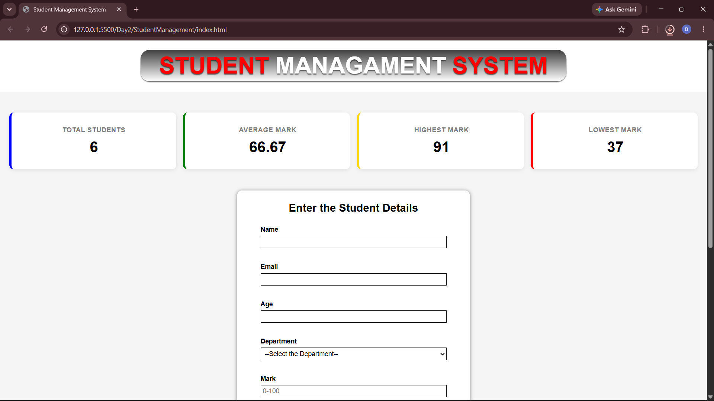
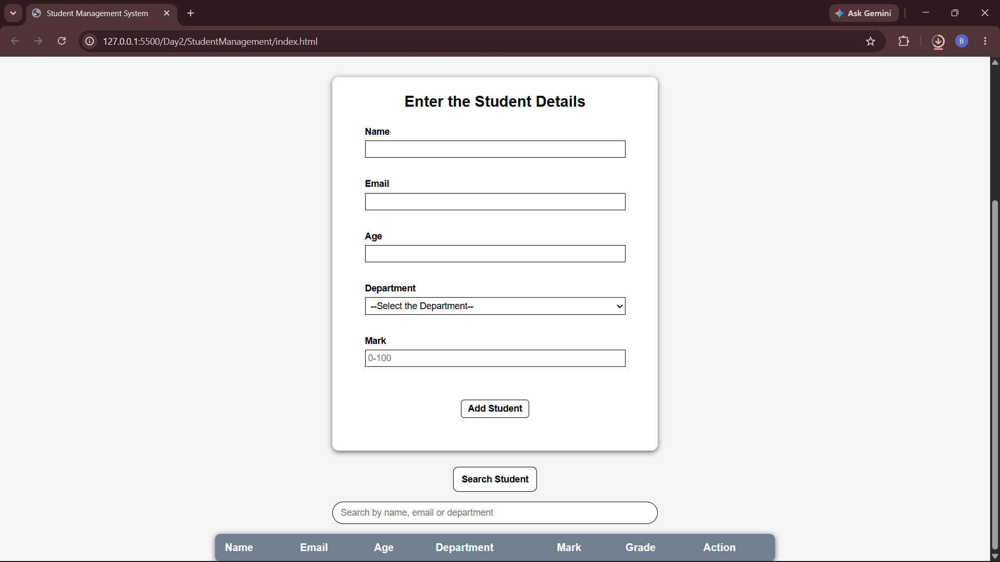
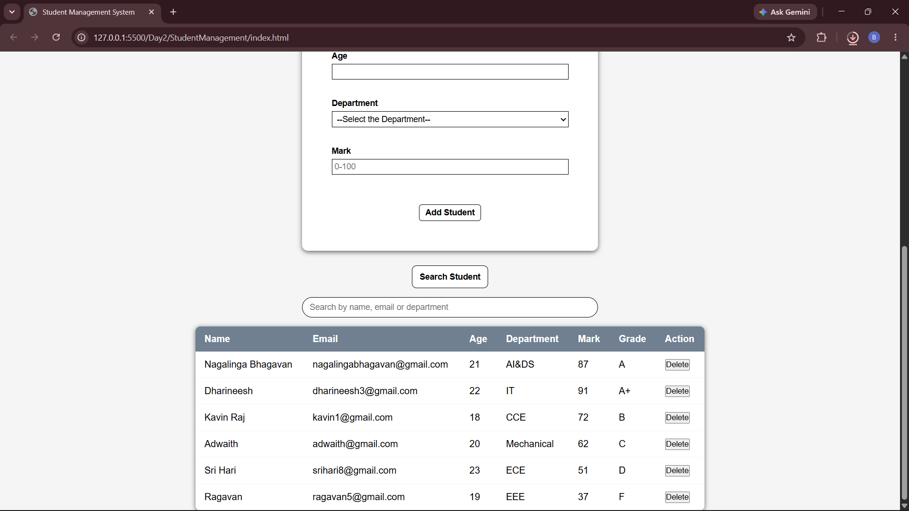
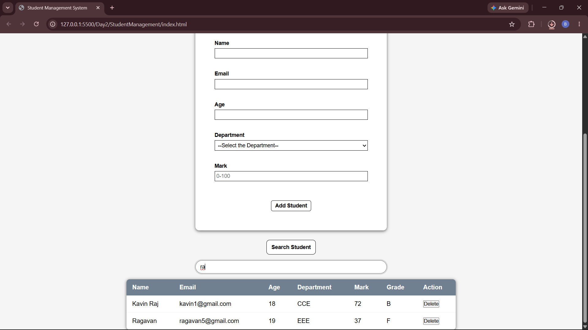
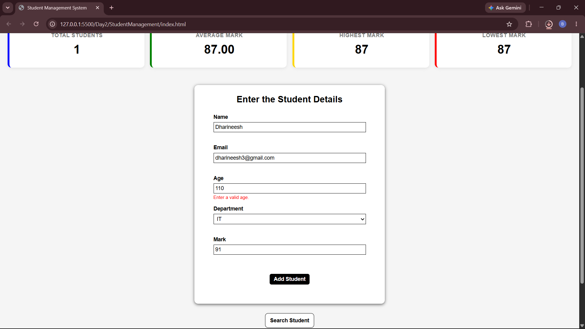

# Student Management System

A simple Student Management System built using **HTML,CSS and JavaScript(ES6+)**

## Features

- **Dashboard** — shows Total Students,Average Mark,Highest Mark and Lowest Mark.
- **Add Student** — to add a student with Name,Email,Age,Department and Mark.
- **Student List** — displays all students in a table with their calculated Grade and a Delete action.
- **Search** — filter students live by Name,Email or Department.
- **Validation** — checks required fields,a valid email format,age range and mark range (0–100) before allowing a student to be added.
- **Grade Calculation**
  - 90–100 -> A+
  - 80–89 -> A
  - 70–79 -> B
  - 60–69 -> C
  - 50–59 -> D
  - Below 50 -> F
- **Delete Student** — removes a student from the list and updates the dashboard.
- **localStorage** — all student data is saved in the browser and reloads automatically on page refresh.

## How It Works

- **Data storage:** Student records are kept in a JavaScript array (`students`) in memory.Every time a student is added or deleted,the array is converted to string with `JSON.stringify()` and saved to `localStorage`.On page load,`JSON.parse()` reads it back and rebuilds the array,this is what makes the data survive in refresh.
- **Validation:** Before a student is added,`validateForm()` checks every field (required values,a valid email pattern,age and mark ranges) and displays inline error messages if something is invalid.If any check fails,the student is not added.
- **Search:** Typing in the search box filters the `students` array (using `.filter()`) into a temporary list matching the name,email,age or department,the original array is never modified,so clearing the search restores the full list.
- **Grade calculation:** `calculateGrade()` takes a numeric mark and returns the matching letter grade based on fixed ranges.

## Screenshots

### Dashboard

### Add Student Form

### Student List

### Search

### Validation
